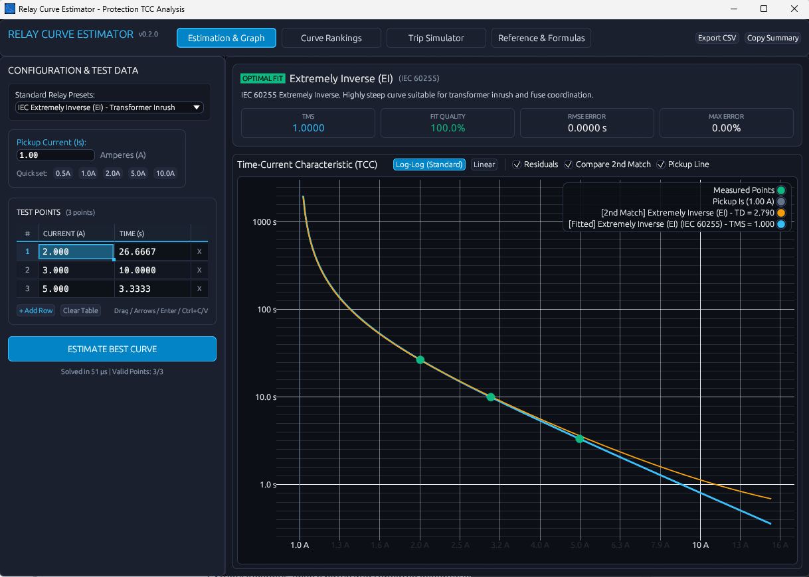

# Relay Curve Estimator

A standalone native desktop application for estimating, analyzing, and plotting protection relay Time-Current Characteristic (TCC) curves according to IEC 60255 and IEEE C37.112 standards.

Built in 100% Rust with hardware-accelerated graphing and an Excel-grade interactive spreadsheet test point grid. Zero web runtimes or external dependencies required.



---

## Quick Start / Download

### For Windows Users (Pre-built Binaries)

No installation or runtime dependencies required:

1. Head to the **[Latest GitHub Release](https://github.com/Tim-Tadj/Relay-Curve-Estimator/releases/latest)**.
2. Download **`relay-curve-estimator-v0.2.0-windows-x64.zip`** (or the standalone `relay-curve-estimator.exe`).
3. Extract the `.zip` archive to any folder on your computer.
4. Double-click **`relay-curve-estimator.exe`** to launch immediately.

---

## User Guide & Features

### 1. Test Points & Excel Spreadsheet Grid
- **Spreadsheet Data Entry**: Full 2D cell grid with row numbers and in-cell editing.
- **Copy & Paste with Excel**: Copy tabular data directly from Microsoft Excel, Google Sheets, or CSV files and press `Ctrl+V` to populate the grid.
- **Range Selection & Drag**: Click and drag across any cell block or use `Shift + Arrow Keys` to select rectangular ranges.
- **Keyboard Navigation**: Use `Arrow Keys`, `Enter`, `Shift+Enter`, `Tab`, and `Shift+Tab` to navigate and auto-expand rows.
- **Clipboard Shortcuts**: Standard `Ctrl+C` (Copy), `Ctrl+X` (Cut), `Ctrl+V` (Paste), `Delete` (Clear selection), and `Ctrl+A` (Select all).

### 2. Inverse Time-Current Characteristic (TCC) Graphing
- **Interactive Log-Log Graph**: Plots fault current (A) against operating trip time (s) on standard logarithmic scales.
- **Accurate Physical Unit Readout**: Hovering over curve lines and measured test points displays exact electrical units (Amperes and Seconds).
- **Candidate Comparison**: Overlays runner-up curve candidates for visual margin analysis.
- **Plot Controls**: Real-time panning, zooming, axis reset, and linear/log toggle.

### 3. Protection Standards & Curve Fitting Engine
- **Microsecond Least-Squares Estimation**: Fits measured test points against all standard inverse time curves simultaneously.
- **Supported Standards**:
  - **IEC 60255**: Standard Inverse (SI), Very Inverse (VI), Extremely Inverse (EI), Long-Time Inverse (LTI).
  - **IEEE C37.112**: Moderately Inverse (MI), Very Inverse (VI), Extremely Inverse (EI), Short-Time Inverse (SI), Long-Time Inverse (LI), Ultra Inverse (UI).
- **Comprehensive Quality Metrics**: Evaluates Optimal Time Dial (TMS / TD), Root Mean Square Error (RMSE), Mean Square Error (MSE), Maximum Relative Error (%), and Fit Quality Score (0–100%).

### 4. Trip Simulator & Formula Reference
- **Forward Operating Time Calculator**: Calculate expected clearing times for arbitrary fault currents and interactive time dial adjustments.
- **LaTeX Mathematical Formulas**: High-precision vector-rendered equation cards for IEC 60255 and IEEE C37.112 standards.
- **Export Capabilities**: One-click clipboard summary export and standard CSV export.

---

## Supported Curve Standards & Equations

### IEC 60255 Standard

Operating time formula:
$$\large t = \frac{k \cdot \text{TMS}}{(I / I_s)^\alpha - 1}$$

| Curve Name | Constant ($k$) | Exponent ($\alpha$) | Common Application |
| :--- | :---: | :---: | :--- |
| **Standard Inverse (SI)** | 0.14 | 0.02 | General distribution feeders |
| **Very Inverse (VI)** | 13.50 | 1.00 | Feeders with substantial fault current drop |
| **Extremely Inverse (EI)** | 80.00 | 2.00 | Transformer inrush & fuse coordination |
| **Long-Time Inverse (LTI)** | 120.00 | 1.00 | Motor thermal & overload protection |

---

### IEEE C37.112 Standard

Operating time formula:
$$\large t = \text{TD} \cdot \left( \frac{A}{(I / I_s)^p - 1} + B \right)$$

| Curve Name | $A$ | $B$ | $p$ | Common Application |
| :--- | :---: | :---: | :---: | :--- |
| **Moderately Inverse (MI)** | 0.0515 | 0.1140 | 0.02 | General distribution coordination |
| **Very Inverse (VI)** | 19.610 | 0.4910 | 2.00 | Heavy overcurrent fast clearing |
| **Extremely Inverse (EI)** | 28.200 | 0.1217 | 2.00 | High fault instantaneous backup |
| **Short-Time Inverse (SI)** | 0.16758 | 0.11858 | 0.02 | Selective high-speed trip |
| **Long-Time Inverse (LI)** | 0.00262 | 0.00262 | 0.02 | Equipment thermal protection |
| **Ultra Inverse (UI)** | 8.9341 | 0.17966 | 2.00 | High-magnitude fast trip |

---

## Building from Source

If you want to build or contribute to the application from source:

### Prerequisites
- [Rust & Cargo](https://www.rust-lang.org/tools/install) (1.80+ or latest stable)

### Build & Run
```bash
# Clone repository
git clone https://github.com/Tim-Tadj/Relay-Curve-Estimator.git
cd Relay-Curve-Estimator

# Run tests
cargo test

# Run in release mode
cargo run --release

# Build standalone release executable
cargo build --release
```

The optimized standalone binary will be placed at `target/release/relay-curve-estimator.exe`.

---

## License

MIT OR Apache-2.0
