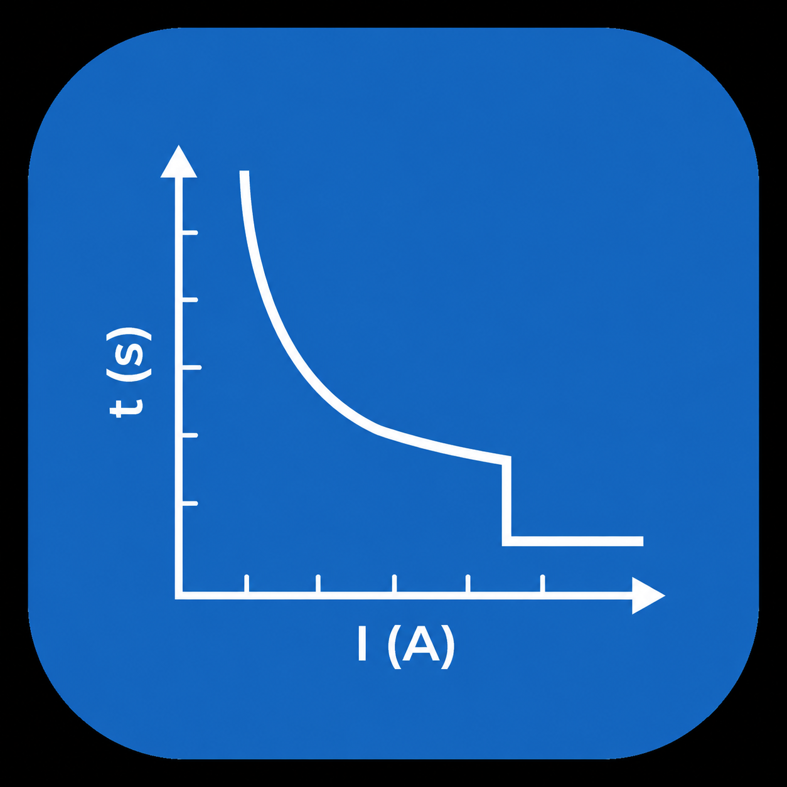

# Relay Curve Estimator (Native Rust)

A high-performance, standalone native Rust GUI application for estimating, analyzing, and plotting protection relay Time-Current Characteristic (TCC) curves.

Built with **eframe**, **egui**, and **egui_plot** with **zero web dependencies**, producing a fast, single native Windows binary with hardware-accelerated graphing.



---

## Features

- **Pure Native Rust & Zero Web Dependencies**: Instant startup, minimal memory footprint, and a single standalone executable without Node.js, Electron, or WebViews.
- **Interactive Log-Log & Linear TCC Graph**:
  - Electrical engineering industry-standard Log-Log scale (Log10 Current vs Log10 Time).
  - Smooth fitted curve rendering, candidate comparison overlays, and measured point markers.
  - Visual residual error indicators and real-time hover crosshair readout.
  - Panning, zooming, auto-fit view, and grid customization.
- **Multi-Standard Curve Engine**:
  - **IEC 60255**: Standard Inverse (SI), Very Inverse (VI), Extremely Inverse (EI), Long-Time Inverse (LTI), Normal Inverse (NI).
  - **IEEE C37.112**: Moderately Inverse (MI), Very Inverse (VI), Extremely Inverse (EI), Short-Time Inverse (SI), Long-Time Inverse (LI), Ultra Inverse (UI).
  - Multi-curve candidate ranking by Root Mean Square Error (RMSE), Mean Square Error (MSE), and Fit Quality percentage.
- **Excel-Grade Spreadsheet Test Point Grid**:
  - Full 2D rectangular range selection with click-and-drag.
  - Keyboard navigation (Arrow keys, Enter, Shift+Enter, Tab, Shift+Tab).
  - In-cell direct numeric typing, F2, and double-click editing.
  - Seamless Excel / Google Sheets TSV Copy (`Ctrl+C`), Cut (`Ctrl+X`), Paste (`Ctrl+V`), and Select All (`Ctrl+A`).
- **Forward Trip Simulator & Dial Tuner**:
  - Calculate trip times for any arbitrary fault current or multiple of pickup.
  - Interactive Time Dial / TMS adjustment slider with real-time curve recalculation.
- **Export Tools**:
  - One-click copy formatted estimation reports to the clipboard.
  - Export test point verifications and curve parameters to standard CSV format.
- **Built-in Presets & Formula Reference**:
  - Standard industry test cases (Feeder overcurrent, Transformer inrush, Motor thermal protection).
  - Complete mathematical formula reference and parameter lookup.

---

## Getting Started

### Prerequisites

- [Rust](https://www.rust-lang.org/) (1.80+ or latest stable)
- Cargo

### Running the Application

```bash
cargo run --release
```

### Running the Test Suite

```bash
cargo test
```

### Building Standalone Release Binary

```bash
cargo build --release
```

The optimized standalone binary will be generated at:
```
target/release/relay-curve-estimator.exe
```

---

## Supported Relay Curve Standards

### IEC 60255

Operating time formula:
$$\large t = \frac{k \times \text{TMS}}{(I / I_s)^\alpha - 1}$$

| Curve Name | Constant ($k$) | Exponent ($\alpha$) | Common Application |
| :--- | :---: | :---: | :--- |
| **Standard Inverse (SI)** | 0.14 | 0.02 | General distribution feeders |
| **Very Inverse (VI)** | 13.50 | 1.00 | Feeders with fault current drop along length |
| **Extremely Inverse (EI)** | 80.00 | 2.00 | Transformer inrush & fuse coordination |
| **Long-Time Inverse (LTI)** | 120.00 | 1.00 | Motor thermal & overload protection |

---

### IEEE C37.112

Operating time formula:
$$\large t = \text{TD} \times \left( \frac{A}{(I / I_s)^p - 1} + B \right)$$

| Curve Name | $A$ | $B$ | $p$ | Common Application |
| :--- | :---: | :---: | :---: | :--- |
| **Moderately Inverse (MI)** | 0.0515 | 0.1140 | 0.02 | General distribution coordination |
| **Very Inverse (VI)** | 19.610 | 0.4910 | 2.00 | Heavy overcurrent fast clearing |
| **Extremely Inverse (EI)** | 28.200 | 0.1217 | 2.00 | High fault instantaneous backup |
| **Short-Time Inverse (SI)** | 0.16758 | 0.11858 | 0.02 | Selective high-speed trip |
| **Long-Time Inverse (LI)** | 0.00262 | 0.00262 | 0.02 | Equipment thermal protection |
| **Ultra Inverse (UI)** | 8.9341 | 0.17966 | 2.00 | High-magnitude fast trip |

---

## Project Structure

```
.
├── assets/
│   └── icon.png               # Application icon
├── src/
│   ├── main.rs                # Entry point, viewport & native options
│   ├── lib.rs                 # Library exports
│   ├── app.rs                 # Main GUI state, tabs, sidebar & layout
│   ├── curves.rs              # Curve definitions, parameters & formulas
│   ├── estimator.rs           # Statistical curve fitting & RMSE engine
│   ├── plot_view.rs           # Interactive egui_plot TCC graphing
│   ├── presets.rs             # Built-in industry standard test cases
│   ├── spreadsheet.rs         # Excel-grade spreadsheet grid engine
│   └── theme.rs               # Dark mode color palette & card frames
├── tests/
│   └── estimator_tests.rs     # Formula & estimation integration tests
├── Cargo.toml                 # Cargo dependencies & release profiles
└── README.md                  # Project documentation
```

---

## License

MIT OR Apache-2.0
